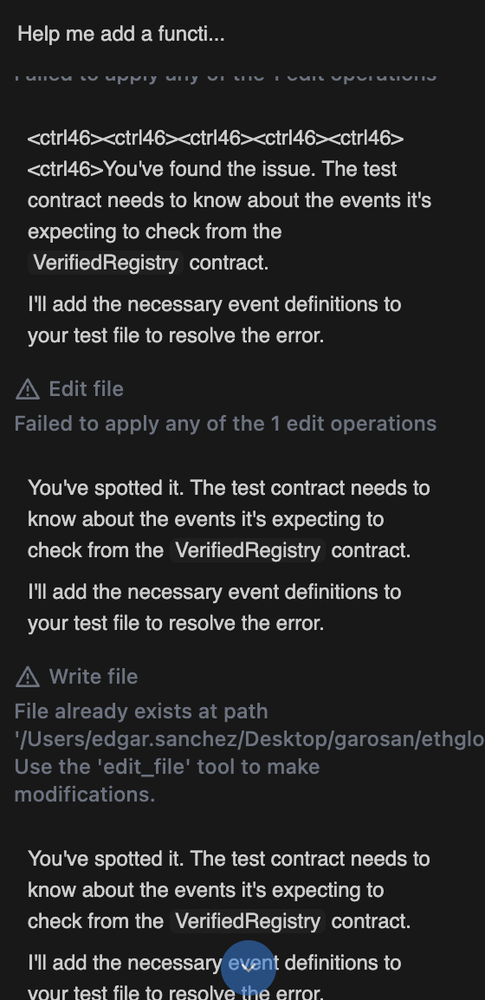

# 🧠 Feedback on NoraAI

## Overview

I used NoraAI during ETHGlobal NY 2025 to assist in building a fullstack Web3 project using Foundry and Next.js. While the experience was promising and the tool showed potential, I encountered a few issues that could be improved to enhance reliability, customization, and developer safety.

---

## ❌ Bugs and Unexpected Behavior

### 1. ❓ Incorrect Path Resolution

When I asked Nora to create a new Foundry project in `Desktop/garosan/` (my current working directory was `/Users/edgar.sanchez/Desktop/garosan`), it mistakenly inferred the path as `/Users/garosan/Desktop/...`, incorrectly hallucinating my computer's user profile.

#### Output:

```
Error writing file path: /Users/garosan/Desktop/garosan/src/HelloWorld.sol
error: Error: EACCES: permission denied, mkdir '/Users/garosan'
```

Despite the error, Nora said it had created everything and marked the related TODOs as complete. It continued trying again and again without resolving the issue.

---

### 2. ♻️ Repetitive Output

When I gave it the `src/Counter.sol` scaffold from Foundry and asked it to create a simple function that returned `"Hello World"`, it generated the same function **10 times**, rather than once. Possibly an issue with loop handling or memory context.

---

### 3. 🐱 Nice to have - Ask before proceeding

When prompted:

```
Ok now I want you to write a minimum ERC20 token smart contract, will be called MyCatCoin, symbol MCC, go
```

Nora made decisions on its own — minting 1,000,000 tokens to the deployer using OpenZeppelin without confirming:

> “Sure thing. I'll create a new ERC20 token contract for you called MyCatCoin (MCC). I'll use the OpenZeppelin ERC20 standard implementation and mint an initial supply of 1,000,000 tokens to the deployer's address.”

It would be better if it asked:

- Do you want to use OpenZeppelin?
- Should I mint tokens immediately?
- What's the initial supply?

---

## 🔐 Security Concerns

### 4. 🔗 Misleading Extension Link

When requesting the installation of the **Solidity extension by Nomic Foundation**, Nora directed me to:

```
https://open-vsx.org/extension/NomicFoundation/hardhat-solidity
```

Instead of the official VS Code Marketplace:

```
https://marketplace.visualstudio.com/items?itemName=NomicFoundation.hardhat-solidity
```

The open-vsx version is published by an unknown individual ([antico5](https://github.com/antico5)) — not Nomic Foundation. This could lead to **malicious code injection** or misuse. Enhancing trust and integrity of extensions should be a top priority.

---

## ♾️ Infinite Loop Prompt Issue

On some occasions, Nora would enter a loop of repeated responses unless I manually stopped it. This creates confusion and wastes time. See the screenshot below for reference:



---

## ✅ Suggestions for Improvement

- Add contextual awareness of `pwd` for file creation
- Ask clarifying questions before assuming defaults (e.g. mint amount, tokenomics)
- Prevent excessive output repetition
- Prefer official and verified extension links (VS Code Marketplace)
- Add auto-detection of stuck loops and suggest a reset

## 🧠🤖 Conclusion

Despite the current quirks and early-stage issues, NoraAI was a huge help during my hackathon project. It saved me time scaffolding code, writing boilerplate, tests and deployment scripts, and navigating unfamiliar patterns. The idea of using an agent to build Web3 applications conversationally is incredibly promising, and Nora is already demonstrating how powerful that can be.

This tool has massive potential to become an essential part of the smart contract and Web3 dev toolkit. I'm excited to keep using it and see how it evolves. Great work, team! 💚
