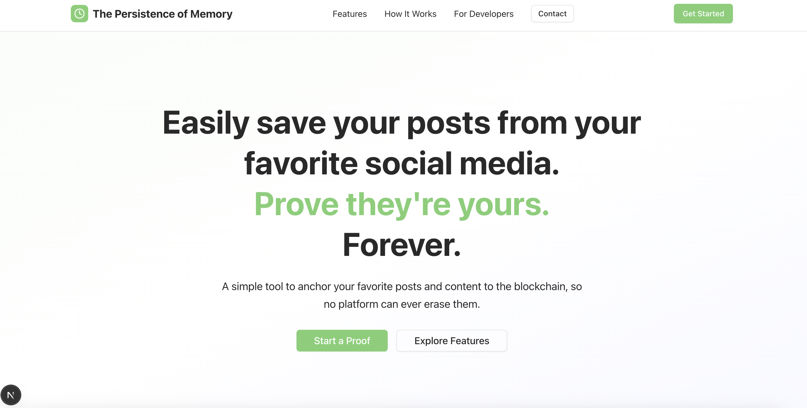

# The Persistence of Memories (A Green App 🟢)

> 🔗 A **Web3 social utility** for backing up, organizing, and anchoring your most meaningful digital memories on-chain — forever.



> 🏆 ETHGlobal NYC 2025 Hackathon Submission
> 💸 Tracks: Flow, Zircuit, Nora
> 📂 GitHub: [https://github.com/garosan/ethglobal_nyc_2025](https://github.com/garosan/ethglobal_nyc_2025)

---

## 📖 Table of Contents

- [Background](#background)
- [Why This Matters](#why-this-matters)
- [How It Works](#how-it-works)
- [Architecture](#architecture)
- [Smart Contract](#smart-contract)
- [Frontend](#frontend)
- [Running the Project](#running-the-project)
- [Future Plans](#future-plans)
- [Links & Resources](#links--resources)
- [License](#license)

---

## 🎨 Background

A week before the hackathon, I lost access to my Instagram account. Years of memories — photos, stories, conversations — gone. No recovery, no explanation. That moment sparked a question:

> What if I could **anchor my digital memories on-chain**, independent of any platform?

**The Persistence of Memory** is a nod to Dalí, MoMA, and the idea that memory — digital or biological — should have permanence, dignity, and portability.

---

## 🧩 Why This Matters

Traditional Web3 social apps struggle because they try to rebuild networks from scratch. **This project doesn't compete with Instagram or Twitter** — it complements them.

### 👇 Problem

- Losing access to a centralized account means losing years of digital memories.
- No easy way to port your social media archive across platforms.
- No on-chain record of content that matters to you.

### 🟢 Solution

- A lightweight, user-friendly utility to:

  - ✅ Back up social posts (e.g., tweets, IG posts)
  - ✅ Organize and tag them
  - ✅ Anchor ownership and timestamps on-chain
  - ✅ Verify authenticity via signatures

This opens the door for future composability: **AI agents**, **decentralized feeds**, **digital estate planning**, and more.

---

## ⚙️ How It Works

1. **User provides content** (e.g., Tweet URL or IG post)
2. The app:

   - Hashes content
   - Extracts platform + metadata
   - Lets user optionally attach a message

3. It is then:

   - Anchored on-chain via a smart contract
   - Marked as **verified** if signed by a trusted verifier

4. The memory is forever yours.

---

## 🏛️ Architecture

```
persistence-of-memory/
├── contracts/             # Solidity smart contract (VerifiedRegistry)
├── web/                   # Next.js frontend (powered by v0 UI + viem)
├── scripts/               # Deployment scripts
├── test/                  # Foundry tests for contracts
├── README.md              # You're here :)
```

---

## 📜 Smart Contract

A minimalist yet powerful registry to store memory proofs:

- `register(...)`: Store unverified proofs
- `registerVerified(...)`: Store proofs signed by a trusted verifier
- Enforces:

  - 🕐 Timestamps
  - 🚫 No duplicates
  - 🔐 EIP-191 signature verification

### Deployed On

- 🟢 Flow EVM Testnet

- 🟢 Zircuit Garfield Testnet

✅ [Verified Contract on Flowscan](https://evm-testnet.flowscan.io)
✅ [Contract Deployment Txn Hash](https://explorer.garfield-testnet.zircuit.com/tx/0x299f67113e496706955020a781c741187e83277867d01e4587013389f33e9544)

✅ [Verified Contract on Zircuit Testnet](https://explorer.garfield-testnet.zircuit.com/address/0x9C168ECBa01408DF02bd6C1C7A50EE0a63859b30?activeTab=3)
✅ [Contract Deployment Txn Hash](https://explorer.garfield-testnet.zircuit.com/tx/0x299f67113e496706955020a781c741187e83277867d01e4587013389f33e9544)

---

## 🖼️ Frontend

A minimalist, responsive landing page built with:

- 💚 Vibrant green accent theme (Flow/Zircuit inspired)
- ✨ NoraAI + v0.dev + Tailwind UI + ShadCN + NextJS
- 🧼 Clean UX: just drop a username or post URL to begin
- 🔒 No wallet required until you choose to anchor

---

## 🚀 Running the Project

### Prerequisites

- Node 18+
- Foundry
- MetaMask or other web3 wallet

### Setup

```bash
# Clone and install
git clone https://github.com/garosan/ethglobal_nyc_2025.git
cd ethglobal_nyc_2025/front
yarn install
yarn dev
```

---

## 🔮 Future Plans

- 📸 Instagram, Twitter, and TikTok OAuth integrations
- 🧾 Downloadable backup ZIPs + IPFS archiving
- 🪙 POAP-style NFTs for memory milestones
- ⚡ Agent-based composability (e.g., auto-archiving posts every week)
- 📂 Folder + tag organization on-chain

---

## 📚 Links & Resources

- 🔗 [Flow Developer Docs](https://developers.flow.com/)
- 🔗 [Zircuit Docs](https://docs.zircuit.com/)
- 🔗 [Nora (AI Solidity agent)](https://mynora.ai/)
- 🔗 [Live Demo](https://ethglobal-nyc-2025.vercel.app/)
- 📝 [ETHGlobal Submission](https://github.com/garosan/ethglobal_nyc_2025)

---

## 📄 License

MIT © 2025 Garosan
